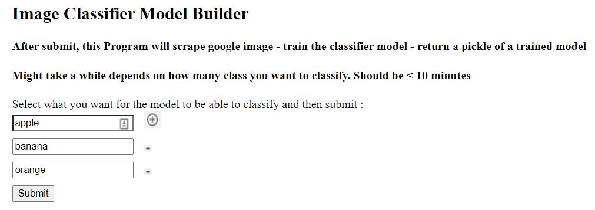
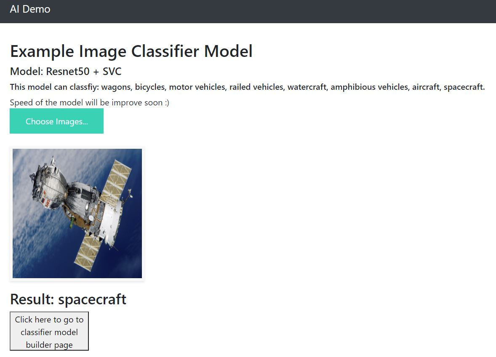
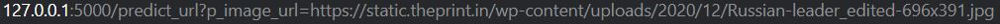
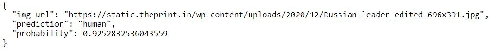
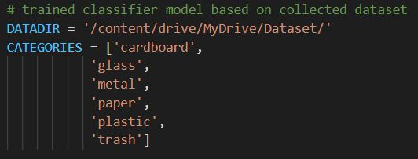
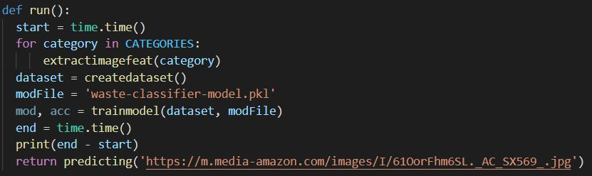

## Custom Image Classfier - Flask Deployment
### Model: Resnet50 + LinearSVC

example_model folder contains classifier model for model testing 

uploads folder contain images for testing the classifier model

classifier_model folder contained trained classifier model based on user input classes

images folder contains .p file for model training based on user input classes

## Usage
Run app.py using below command to start Flask API
```
python app.py
```
# 1. model builder

Pipeline
1. Scraping google images based on user input classes
2. Extract feature by using resnet50 and store data in images folder
3. Trained model with LinearSVC
4. Return an image classifier model file that can be opened with joblib

Image Classfier model builder:
Add image classes and submit to download trained classifier model based on user input classes


# 2. predict image via uploading

Upload image and submit


# 3. predict image via image url

Predict image from image link address



# 4. build image classifier model trained on collected data

run train_model_from_collected_data.py




